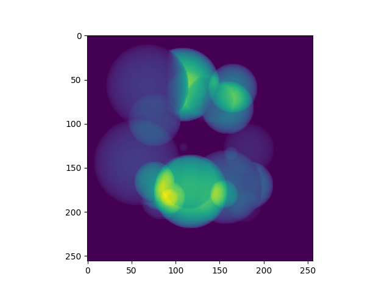
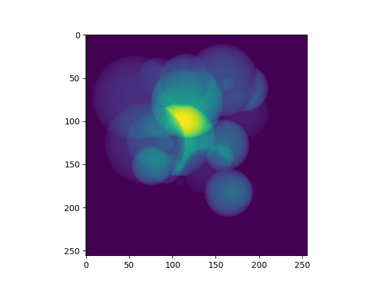
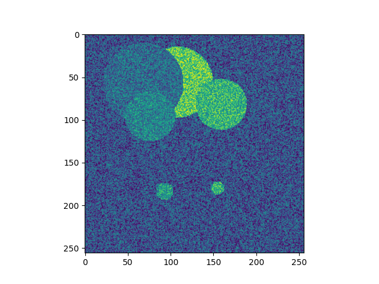
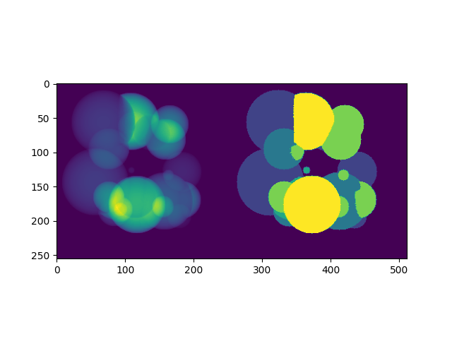
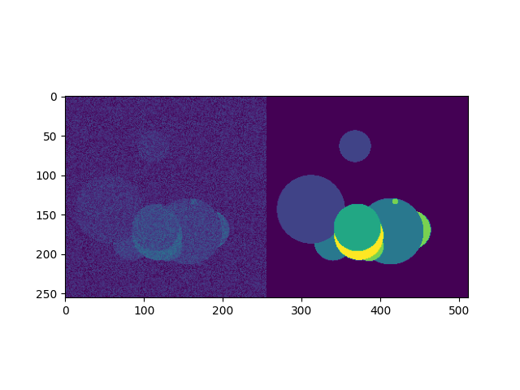
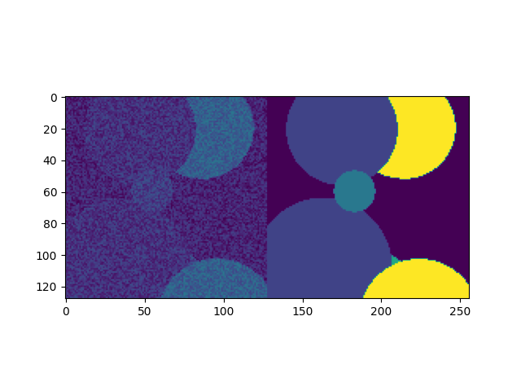
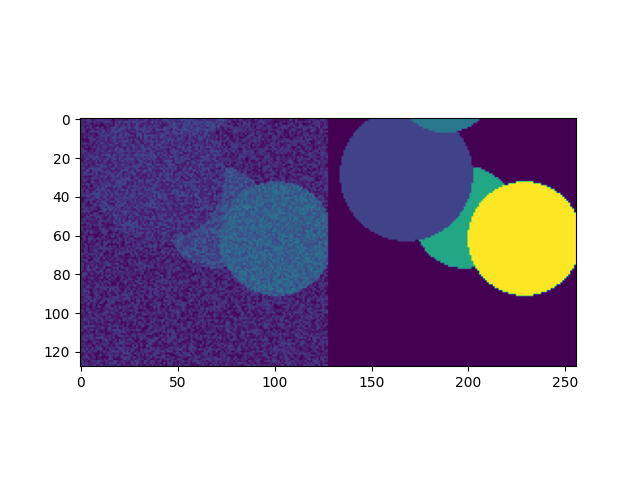
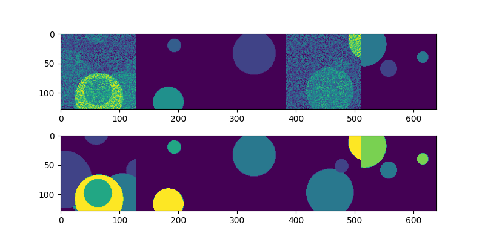

=====================
Tutorial - Transforms
=====================
MONAI Bootcamp 2021 Day 1: 1. Getting Started - MONAI Transforms

| Tutorial: https://github.com/Project-MONAI/MONAIBootcamp2021/blob/main/day1/1.%20Getting%20Started%20with%20MONAI.ipynb
| Video: https://youtu.be/Ih-4xzRJYO0

MONAI has transforms in six categories: Crop & Pad, Intensity, IO, Post-processing, Spatial, and Utilities. Medical image specific transformations include:

*   LoadImage: Load medical specific formats file from provided path
*   Spacing: Resample input image into the specified pixdim
*   Orientation: Change the image’s orientation into the specified axcodes
*   RandGaussianNoise: Perturb image intensities by adding statistical noises
*   NormalizeIntensity: Intensity Normalization based on mean and standard deviation
*   Affine: Transform image based on the affine parameters
*   Rand2DElastic: Random elastic deformation and affine in 2D
*   Rand3DElastic: Random elastic deformation and affine in 3D

Run :code:`python` in the terminal then import dependencies:

.. code-block:: python

    import tempfile
    import nibabel as nib
    import numpy as np
    import matplotlib.pyplot as plt
    from typing import Optional, Any, Mapping, Hashable

    import monai
    from monai.config import print_config
    from monai.utils import first
    from monai.config import KeysCollection
    from monai.data import Dataset, ArrayDataset, create_test_image_3d, DataLoader
    from monai.transforms import (
        Transform,
        MapTransform,
        Randomizable,
        AddChannel,
        AddChanneld,
        Compose,
        LoadImage,
        LoadImaged,
        Lambda,
        Lambdad,
        RandSpatialCrop,
        RandSpatialCropd,
        ToTensor,
        ToTensord,
        Orientation, 
        Rotate
    )

Make sure everything was imported correctly with the correct versions::

    print_config()

Create a temporary directory and populate it with a 5 example Nifti file-format images containing a random assortment of spheres and matching segmentation pairs:

.. code-block:: python

    fn_keys = ("img", "seg")  # filename keys for image and seg files

    root_dir = tempfile.mkdtemp()
    filenames = []

    for i in range(5):
        im, seg = create_test_image_3d(256, 256, 256, num_objs=25, rad_max=50)\
        
        im_filename = f"{root_dir}/im{i}.nii.gz"
        seg_filename = f"{root_dir}/seg{i}.nii.gz"
        filenames.append({"img": im_filename, "seg": seg_filename})\
        
        n = nib.Nifti1Image(im, np.eye(4))
        nib.save(n, im_filename)\
        
        n = nib.Nifti1Image(seg, np.eye(4))
        nib.save(n, seg_filename)

Transforms are composed with :code:`Compose` to create a sequence of operations. :code:`Compose` itself being a transform we can also call it directly. The type of img here is :code:`numpy.ndarray` so to convert to a Pytorch tensor as part of a training data pipeline we'd have :code:`ToTensor` as the last transform in our sequence:

.. code-block:: python

    trans = Compose([LoadImage(image_only=True), AddChannel(), ToTensor()])
    img = trans(filenames[0]["img"])
    print(type(img), img.shape, img.get_device())

Result should be :code:`<class 'torch.Tensor'> torch.Size([1, 256, 256, 256]) -1`

You can define custom transform operations in a number of ways. If a simple callable is used as an operator, :code:`Lambda` can be used to wrap it as a transform. We define in this example a transform to sum the image in the 1st (width) dimension to produce a 2D image:

.. code-block:: python

    def sum_width(img):
        return img.sum(1)

    trans = Compose([LoadImage(image_only=True), AddChannel(), Lambda(sum_width)])
    img = trans(filenames[0]["img"])
    plt.imshow(img[0])
    plt.show()

Creating a subclass of Transform is the second method, and this has the advantage of being able to define attributes with the instantiated objects. Define a class to sum in a chosen dimension, and use it to sum in the 2nd (height) dimension:

.. code-block:: python

    class SumDimension(Transform):
        def __init__(self, dim=1):
            self.dim = dim\
    
        def __call__(self, inputs):
            return inputs.sum(self.dim)

    trans = Compose([LoadImage(image_only=True), AddChannel(), SumDimension(2)])
    img = trans(filenames[0]["img"])
    plt.imshow(img[0])
    plt.show()

The :code:`Randomizable` class is used to randomize variables but also distinguish from deterministic transforms.

In this class we have a :code:`numpy.random.RandomState` object to provide stochastic values. This can be replaced using :code:`Randomizable.set_random_state()` to control the randomization process. The :code:`randomize()` method is responsible for determining if the random operation is to be performed based on the :code:`prob` probability member, then creates the random noise array if so. This functionality is in this method so that it can be called by :code:`Compose` or other external controllers.

The following code defines a simple transform to add noise. Run it a few times to see the random transform being applied 50% of the time.

.. code-block:: python

    class RandAdditiveNoise(Randomizable, Transform):
        def __init__(self, prob: float = 0.5, max_add: float = 1.0) -> None:
            self.prob = np.clip(prob, 0.0, 1.0)
            self.max_add = max_add
            self._noise = 0\

        def randomize(self, data: np.ndarray) -> None:
            self._noise = 0\

            if self.R.random() < self.prob:
                noise_array = self.R.rand(*data.shape[1:])[None]
                self._noise = (noise_array * self.max_add).astype(data.dtype)\

        def add_noise(self, img: np.ndarray) -> np.ndarray:
            return img + self._noise\

        def __call__(self, img: np.ndarray) -> np.ndarray:
            self.randomize(img)
            return self.add_noise(img)

    trans = Compose([LoadImage(image_only=True), AddChannel(), RandAdditiveNoise()])
    img = trans(filenames[0]["img"])
    plt.imshow(img[0, 128])
    plt.show()

**Dictionary Transforms**

The previous transforms were applied to individual Numpy arrays, but for most training schemes, a pipeline with multiple values is needed. To address this, MONAI includes transforms for operating on dictionaries of arrays, one for each equivalent array transform. These can be applied to named values in an input dictionary while leaving unnamed values untouched, for example adding noise to an image while leaving the associated label image untouched.

The dictionary equivalent transforms indicated by :code:`d` appended to their names will be used in this section. The :code:`keys` argument in :code:`LoadNiftid` is used to state which keys contain paths to Nifti files; all other values in the input dictionary will be retained. Use this set to look at the keys returned when calling the transform:

.. code-block:: python

    trans = LoadImaged(keys=fn_keys)
    data = trans(filenames[0])
    print(list(data.keys()))

Result should be :code:`['img', 'seg', 'img_meta_dict', 'seg_meta_dict']`

:code:`Lambdad` applies the given callable to each array named by keys separately. Use this to define transforms operating on different named values in the dictionary at different points in the sequence:

.. code-block:: python

    def sum_width(img):
        return img.sum(1)

    def max_width(img):
        return img.max(1)

    trans = Compose([LoadImaged(fn_keys), AddChanneld(fn_keys), Lambdad(("img",), sum_width), 
                    Lambdad(("seg",), max_width)])

    imgd = trans(filenames[0])
    img = imgd["img"]
    seg = imgd["seg"]

    plt.imshow(np.hstack((img[0] * 5 / img.max(), seg[0])))
    plt.show()

The above applies one operation to one member of the dictionary and different operation to another. A reasonable re-implementation of this in one transform would require retaining the names of which members to apply which transform to and applying the operations in one method. Adapting array-based transforms to operate over dictionaries is relatively straight-forward.

Run this cell a few times to see the random transform being applied 50% of the time:

.. code-block:: python

    class RandAdditiveNoised(Randomizable, MapTransform):
        def __init__(
            self, keys: KeysCollection, prob: float = 0.5, max_add: float = 1.0
        ) -> None:
            super(Randomizable, self).__init__(keys)
            self.transform = RandAdditiveNoise(prob, max_add)\

        def set_random_state(
            self, seed: Optional[int] = None, state: Optional[np.random.RandomState] = None
        ) -> "RandAdditiveNoised":
            self.transform.set_random_state(seed, state)
            super().set_random_state(seed, state)
            return self\

        def randomize(self, data: Optional[Any] = None) -> None:
            self.transform.randomize(data)\

        def __call__(
            self, data: Mapping[Hashable, np.ndarray]
        ) -> Mapping[Hashable, np.ndarray]:
            self.randomize(data[monai.utils.first(self.keys)])\

            d = dict(data)
            for key in self.keys:
                d[key] = self.transform.add_noise(d[key])
            return d
        
    trans = Compose([LoadImaged(fn_keys), AddChanneld(fn_keys), RandAdditiveNoised(("img",))])
    img = trans(filenames[0])

    # We're adding random noise to the image, not the segmentation
    plt.imshow(np.hstack([img["img"][0, 50], img["seg"][0, 50]]))
    plt.show()

Method overrides are provided to delegate behaviour to an internal RandAdditiveNoise instance:

*   :code:`set_random_state` sets the state of the delegate and the current object
*   :code:`randomize` delegates the randomization to the :code:`RandAdditiveNoise` instance
*   :code:`__call__` causes the delegate to randomize then applies the transform to each named member of the dictionary. The delegate transform is randomized only once, this ensures the same random field is added to each named member of the dictionary, a slightly different implementation adding a per-key random field would be needed if this were the desired behaviour.

**Create a basic MONAI dataset with transforms**

With a data source and transforms defined you can now create a dataset object. The base class for MONAI is :code:`Dataset`, created here to load the image Nifti files only. :code:`Dataset` inherits from the Pytorch class of that name and adds only the ability to apply the given transform to selected items. 

.. code-block:: python
    
    images = [fn["img"] for fn in filenames]

    transform = Compose([LoadImage(image_only=True), AddChannel(), ToTensor()])
    ds = Dataset(images, transform)
    img_tensor = ds[0]
    print(img_tensor.shape, img_tensor.get_device())

Result should be :code:`torch.Size([1, 256, 256, 256]) -1`

MONAI provides the :code:`ArrayDataset` for supervised training applications specifically. It can accept data arrays for images separate from those for segmentations or labels with their own separate transforms. Here you will again separate out the image and segmentation filenames to demonstrate this usage:

.. code-block:: python

    images = [fn["img"] for fn in filenames]
    segs = [fn["seg"] for fn in filenames]

    img_transform = Compose([LoadImage(image_only=True), AddChannel(), 
                            RandSpatialCrop((128, 128, 128), random_size=False), RandAdditiveNoise(), ToTensor()])
    seg_transform = Compose([LoadImage(image_only=True), AddChannel(), 
                            RandSpatialCrop((128, 128, 128), random_size=False), ToTensor()])

    ds = ArrayDataset(images, img_transform, segs, seg_transform)
    im, seg = ds[0]
    plt.imshow(np.hstack([im.numpy()[0, 48], seg.numpy()[0, 48]]))
    plt.show()

Instead of returning a single image, accessing a member of the dataset produces a pair containing the image and segmentation after being passed through their respective transforms. One important aspect of this class is that the random state of each transform (:code:`Compose` in this case) is set to that of the dataset before being applied. This ensures the same random operations are applied to each output, which is why the :code:`RandSpatialCrop` operation chooses the same crop window for the image as well as the segmentation. By having separate transforms one can apply operations to images and not to segmentations (or vice versa), being careful that these unshared operations come after the shared ones.

Alternatively, :code:`Dataset` can be used with dictionary-based transforms to construct a result mapping. For training applications beyond simple input/ground-truth pairs like the above this would be more suitable:

.. code-block:: python

    trans = Compose([LoadImaged(fn_keys), AddChanneld(fn_keys), RandAdditiveNoised(("img",)), 
                    RandSpatialCropd(fn_keys, (128, 128, 128), random_size=False), ToTensord(fn_keys)])

    ds = Dataset(filenames, trans)
    item = ds[0]
    im, seg = item["img"], item["seg"]
    plt.imshow(np.hstack([im.numpy()[0, 48], seg.numpy()[0, 48]]))
    plt.show()

With the dataset defined, you can now create the dataloader to create data batches. This inherits directly from Pytorch's :code:`DataLoader` class with a few changes to the default constructor arguments. MONAI functionality should be compatible with the PyTorch :code:`DataLoader`, but it was subclasses to include additional functionality that we consider key and which cannot be realized with the standard :code:`DataLoader` class.

The :code:`DataLoader` will use five worker processes to load the actual data. MONAI provides a number of :code:`Dataset` subclasses to improve the efficiency of this process. These and other features will be covered in subsequent labs.

.. code-block:: python

    loader = DataLoader(ds, batch_size=5, num_workers=5)
    batch = first(loader)
    print(list(batch.keys()), batch["img"].shape)

    f, ax = plt.subplots(2, 1, figsize=(8, 4))
    ax[0].imshow(np.hstack(batch["img"][:, 0, 64]))
    ax[1].imshow(np.hstack(batch["seg"][:, 0, 64]))
    plt.show()

Result should be :code:`['img', 'seg', 'img_meta_dict', 'seg_meta_dict', 'img_transforms', 'seg_transforms'] torch.Size([5, 1, 128, 128, 128])`
    
